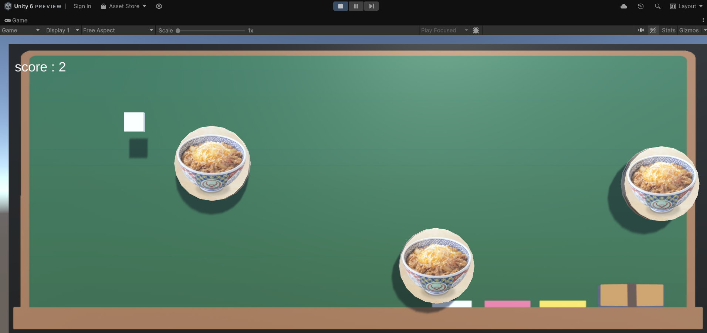

# HackU_TeamMizove

LINEヤフー様主催の公大高専HackUに向けて開発しているシューティングゲームのリポジトリです。

ローカル環境にダウンロード後は、HackUフォルダをUnityから開いていただければ遊ぶことも編集も可能となります。

実際にはM5StickC Plus2を使用してコントローラー操作を行うゲームですが、マウスでもプレイすることができます。

マイコン側のプログラムは[こちら](https://github.com/kuri227/hackU)

注意：Unityで開く前にLibraryフォルダを削除してください。エラーが発生することを予防できます。

環境：
- Unity 6000.0.11f1

プレイ画面：

